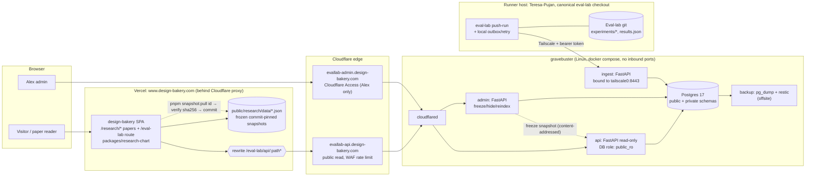

# TASK-0060: Live Eval Lab app on gravebuster (architecture)

Issues: Pukujan/Eval-lab#71 (this task), Pukujan/design-bakery#50 (TASK-DB-0055 `/eval-lab` route).

Status: plan only (2026-09-24 ET). Nothing was deployed, tunneled or exposed, and no secrets were read.
Related: Pukujan/Eval-lab#69 (TASK-0059 provenance export), Pukujan/design-bakery#49 (TASK-DB-0054 research chart), Pukujan/design-bakery#48 (TASK-DB-0053 paper rendering), Pukujan/design-bakery#50 (TASK-DB-0055, the `/eval-lab` route).
Inputs: Eval-lab @ `0b996a5`, design-bakery @ `1ed2f63`, and the research reports on Pukujan/design-bakery#49 (charts) and Pukujan/Eval-lab#69 (provenance).

## TL;DR
- **Two layers, one schema.** Papers embed **frozen, commit-pinned chart-data files** (schema v1 from Pukujan/design-bakery#49 + Pukujan/Eval-lab#69) and never call the live app. The live app serves the **same schema** from a database, so one React chart component renders both.
- **Recommended split.**
  - **Backend, DB, ingest and deploy** go in **Eval-lab under `live/`**: FastAPI + Postgres 17. It reuses `eval_lab` pydantic models, the metrics code and the Pukujan/Eval-lab#69 exporter/JSON Schema.
  - **Frontend** is a lazy **`/eval-lab` route in design-bakery**. It reuses the Pukujan/design-bakery#49 chart as a workspace package, `packages/research-chart`.
  - **No new repo.**
- **Why the frontend lives on Vercel and not on gravebuster:** if gravebuster is off, a fully proxied SPA gives visitors a Cloudflare 530/1033 error page. With the shell on Vercel, only `/eval-lab/api/*` is proxied, so the page can say "live data offline" and fall back to the last committed snapshot.
- **Network paths:**
  - Public reads: Vercel rewrite → `evallab-api.design-bakery.com` (Cloudflare Tunnel, no open ports). The design-bakery.com zone is already on Cloudflare (NS `mack`/`raquel.ns.cloudflare.com`, orange-clouded in front of Vercel).
  - Admin: `evallab-admin.design-bakery.com`, behind Cloudflare Access.
  - Ingest: **Tailscale only**. It's never on the tunnel.
- **gravebuster facts:** still **not a registered machine** (registration is an Alex-side admin action), but it is reachable from the workstation over the pre-existing Tailscale SSH alias, and its specs are now verified: Linux x86_64, 16 cores, 30 GiB RAM, ~150 GB free disk, Docker 29.6.1 + Compose v5.2.0. The node is **owned by a different Tailscale account** and shared into the tailnet; it already runs the study-os and design-bakery stacks.
- **Blocking finding:** the 760-record "blind holdout", gold labels included, is committed in the **public** Eval-lab repo. Example: `experiments/EXP-20260921-014-independent-jev-benchmark/records.jsonl`, added 2026-09-21 in `108a80e`. The live app must not make this worse, but it can't undo it. See Decisions.

## 1. Facts gathered
| Item | Finding |
|---|---|
| Registered machines | `Teresa-Pujan` (Windows, connected) and `Teresas-Air.lan` (offline). **No `gravebuster`.** |
| gravebuster (verified over Tailscale SSH, 2026-09-25) | Linux x86_64, 16 cores, 30 GiB RAM (~10 GiB available), ~150 GB free disk, Docker 29.6.1 + Compose v5.2.0. Reachable from the workstation through the pre-existing SSH alias (key auth); formal machine registration is still pending on Alex's side. Already hosts the study-os stack (incl. the token-based cloudflared tunnel), the loopback-only `design-bakery-web` container (design-bakery#54) and other stacks (~54 containers); the eval-lab live stack fits comfortably. Credentials/identifiers are deliberately not recorded here. |
| Teresa-Pujan (current runner host, `D:\claude\eval-lab`) | docker 29.5.3, node (nvm4w), Python 3.12, cloudflared 2026.5.2, Tailscale 1.102.2 |
| Cloudflare credentials | An existing local config file with the Cloudflare token exists on Alex's workstation. **Not opened or read.** A fresh tunnel token is recommended (§10). |
| DNS | design-bakery.com NS is on Cloudflare. `www` is proxied by Cloudflare → Vercel (`server: cloudflare`, `x-vercel-id`). So a tunnel hostname can be added to the same zone. |
| design-bakery `vercel.json` | Precedent already exists: `/ai-for-good/*` is an external rewrite (with a trailing-slash redirect), and `/studyos` redirects to `study.design-bakery.com`. The catch-all SPA rewrite `/((?!.*\.html$).*) → /index.html` is last. Root `middleware.ts` only matches blogs/case-studies. |
| Eval-lab storage today | `experiments/EXP-*/` (26 dirs, 93 MB) each hold `experiment.yaml` (id, status, code_commit, dataset fingerprints, generation settings, judge, rubric, metrics), `README/PLAN/RESULTS.md` and `runs/<run_id>/`. Each run has `results.json`, `predictions.jsonl`, `report.md` and `checksums.sha256`. `results.json` holds run_id, created_at_utc, experiment_id, partition, provider, requested_model, record_count, resolved_count, status_counts, source_pool fingerprints, streaming and workers. Prediction rows hold record_id, judge_id, protocol_version, label, probabilities, raw_scores, execution_status, latency_ms, token_usage, provider_metadata and error. Totals: 140 `results.json`, 123 `predictions.jsonl`. Consolidation happens in EXP-029 `results.json` (26 arms, Wilson CIs, by_mode/by_source, McNemar/Holm). Runners are `scripts/run_*.py`; library code is `src/eval_lab/{schema,metrics,judges,datasets,…}`. TASK-0058 already emits `paper/figures/benchmark/NAME.data.json`. |
| Eval-lab rules | Completed experiments are immutable. There is one canonical checkout (`D:\claude\eval-lab`), and the workspace policy is enforced in CI. CI has read-only permissions and makes no paid calls. Task files need Goal / Acceptance criteria / Checkpoint log / Handoff. |

## 2. Architecture

Summary: readers always load the SPA from Vercel. Papers read committed snapshot files only. The `/eval-lab` route calls `/eval-lab/api/*`, which Vercel rewrites to the tunnel hostname, and that reaches the read-only API on gravebuster. The runner pushes finished runs over Tailscale to a separate ingest service. Admin is a separate hostname behind Access. Snapshots get frozen on gravebuster, then pulled into design-bakery with a hash check and committed.

## 3. Stack (and why)
| Layer | Choice | Reasoning |
|---|---|---|
| Frontend | React 18 + Vite 6 + TS + Tailwind v4 + Radix/shadcn, as a lazy route in the design-bakery SPA | Same stack, theme (`.dark`) and chart component as the papers. No second site or base-path juggling. Shell stays up when gravebuster is down. |
| Chart | `packages/research-chart` (the Pukujan/design-bakery#49 custom SVG + d3-scale/array/format) | One component for papers (static SVG + hydrate) and the live app (data from the API). Generic `dimensions/measures/entities/observations` schema, so it works for any project, with any metrics or none (table/metadata-only views). |
| Backend | **FastAPI (Python 3.12, uv)** | Reuses `eval_lab.schema` pydantic models, `eval_lab.metrics` (Wilson CIs etc.) and the Pukujan/Eval-lab#69 exporter, so the live numbers use the **same code path as the paper numbers**. A Node backend would mean reimplementing the metrics, and drift. Pydantic → OpenAPI → TS types for the frontend. |
| DB | **Postgres 17** (docker) | SQLite (WAL) would fit the load too. Postgres wins on **DB-level role separation** (public API role can't `SELECT` the private predictions schema: a leakage backstop), JSONB for configs/provenance, concurrent ingest + reads, `pg_dump`/PITR backups, and familiarity (design-bakery already uses Supabase/Postgres). DuckDB isn't used as the OLTP store. It's optional later, for ad hoc analysis over Parquet exports. |
| Migrations | Alembic | Versioned. CI tests up/down against a Postgres service container. |
| Transport | cloudflared (token-based, remotely managed) for public/admin; Tailscale for ingest/SSH | Outbound-only tunnel, no open ports. Ingest never leaves the tailnet. |

## 4. Where the code lives (recommendation: Eval-lab `live/` + design-bakery route)
| Option | Pros | Cons |
|---|---|---|
| **A. Eval-lab `live/` (backend, ingest client, compose) + design-bakery `/eval-lab` route (frontend)**: recommended | Schema, metrics, exporter and ingest evolve in one repo and one CI. The frontend shares the chart and theme with papers. No new repo to maintain. | Eval-lab gains web deps. Keep them in a uv optional group `live` so research installs stay lean. The image is built by a separate workflow with `packages: write`, and the main CI stays read-only. |
| B. New repo `Pukujan/eval-lab-live` (full stack) | Clean separation, own release cadence | Has to vendor/pin the schema and metrics code (drift risk), duplicates the chart component, and needs a base-path SPA behind a proxy (offline = CF error page). |
| C. design-bakery monorepo package for the backend too | One repo for web | Python metrics code has to be duplicated in Node, or Python added to design-bakery CI. Mixes a Vercel app with a self-hosted service. |

gravebuster never clones a repo. It pulls a **pinned image** (`ghcr.io/pukujan/eval-lab-live@sha256:…`), which respects Eval-lab's single-canonical-checkout policy.

## 5. Data model (Postgres; `public` = safe to serve, `private` = never served)
- `projects(id, name, description)`: makes the app generic (eval-lab is one project).
- `datasets(id, project_id, name, version, records_fingerprint, blind_ids_fingerprint, spec_fingerprint, record_count, public_count, blind_count, split_policy)`
- `experiments(id 'EXP-…', project_id, title, hypothesis, status, code_commit, created_at, yaml jsonb, repo_path)`
- `judges(id, provider, model, route, family, params_b, deployment[api|local|baseline], short_label)`
- `arms(id, experiment_id, judge_id, config jsonb {thinking, max_tokens, temperature, prompt_version, rubric_version, adapter, context_limit}, config_hash, headline bool)`: structured config, replacing the free-text `harness`.
- `runs(run_id pk, arm_id, dataset_id, partition[public_selection|blind_holdout|…], status[running|complete|failed|superseded], started_at, finished_at, elapsed_s, record_count, resolved_count, status_counts jsonb, code_commit, tree_dirty bool, runner_host, git_committed bool, eval_lab_commit, visibility[public|provisional|hidden], ingest_id)`
- `metrics(key, project_id, label, unit, format, better[higher|lower|none], interval_method, description)`: a metric registry. Zero metrics is valid.
- `observations(run_id, metric_key, slice_dim, slice_value, value, ci_low, ci_high, n)`: tidy, same shape as the chart schema's `observations`.
- `aggregates(id, metric_key, method, derived_from_run_ids[], value, ci_low, ci_high, n)`: declared merges only. The browser never averages across arms.
- `comparisons(id, a_entity, b_entity, test, statistic, p, p_holm, scope)`: McNemar/Holm etc.
- `artifacts(run_id, path, sha256, bytes, kind)`: every file hash from `checksums.sha256` / the ingest payload.
- `activities(id, type[run|ingest|analysis|export|freeze], agent, software, commit, started_at, ended_at, used jsonb, generated jsonb)`: rendered as PROV-O JSON-LD (the Pukujan/Eval-lab#69 context).
- `snapshots(id, created_at, frozen_by, spec jsonb, schema_version, content jsonb, sha256, run_ids[], all_runs_committed bool, eval_lab_commit)`: immutable, never updated.
- `ingest_log(id, runner_id, received_at, payload_sha256, run_id, outcome, error)`
- `private.predictions(run_id, record_id, label, execution_status, latency_ms, tokens, cost, provider_metadata jsonb)`: for recompute and audits only. **No record text, no prompts, no gold.** The `public_ro` role has no grant on `private.*`.

## 6. APIs
**Read API (public, GET only, `/api/v1`, via `/eval-lab/api/v1/*`)**. Every chart endpoint returns a **chart-data v1 document** (the Pukujan/design-bakery#49 §7 / Pukujan/Eval-lab#69 JSON Schema: `provenance`, `dimensions`, `measures`, `entities`, `observations`, `aggregates`, `comparisons`, JSON-LD `@context`).
- `GET /status`: `{ok, db, last_ingest_at, runs_total, version}` (drives the offline banner)
- `GET /projects`, `/datasets`, `/experiments`, `/judges`, `/metrics`
- `GET /leaderboard?project=&dataset=&partition=blind_holdout&metric=&level=summary`
- `GET /explore?level=summary|breakdown|experiment|run&filters…&facet=`: never per-record for blind partitions (enforced server-side; see §11)
- `GET /trends?metric=&judge=&from=&to=`: time series of runs
- `GET /runs/{run_id}` (metadata, status, artifacts with sha256) and `GET /runs/{run_id}/provenance.jsonld`
- `GET /snapshots` and `GET /snapshots/{id}.json`: immutable, `Cache-Control: public, max-age=31536000, immutable`

**Ingest API (Tailscale only, `ingest` service bound to the tailscale IP:8443, not in the tunnel ingress)**
- `POST /ingest/v1/runs`: body = run manifest (experiment.yaml subset, results.json summary, arm config, observations computed by `eval_lab` code, artifact hashes). Optionally `private.predictions` rows without text/gold. **Idempotent** on `(run_id, payload_sha256)`. A changed payload for a completed run is rejected with `409` (experiments are immutable). Supersede explicitly with `supersedes`.
- `PATCH /ingest/v1/runs/{run_id}/progress` (optional live progress: n done / n total, status counts)
- Auth: per-runner bearer token (argon2-hashed in the DB, rotatable, scoped to `ingest`), **and** the source must be a tailnet IP. Tailscale ACL: only tag `runner` → `gravebuster:8443`. Pydantic `extra="forbid"` plus a denylist (`gold`, `prompt`, `candidate_*`, `answer_key`, `evidence`) rejects payloads that could leak records.
- Runner side: `uv run eval-lab push-run experiments/EXP-…/runs/<id>` (and `--backfill` to ingest the 140 existing result files). It writes to a local **outbox** (`outputs/live-outbox/`, gitignored) and retries with backoff, so runs are never lost while gravebuster is off. Hooked at the end of `run_*.py` via a shared `finalize_run()`.

**Admin API (`evallab-admin.design-bakery.com`, Cloudflare Access; also reachable over Tailscale)**
- `POST /admin/snapshots {spec}` → freezes the query result into `snapshots` (content-addressed sha256), returns the id
- `POST /admin/runs/{id}/visibility`, `POST /admin/reindex`, `POST /admin/runner-tokens` (create/rotate/revoke)
- The backend also validates the `Cf-Access-Jwt-Assertion` JWT against the team's Access certs (defence in depth, in case of tunnel misrouting).

## 7. Snapshot freezing (papers never break)
1. Alex (admin) or a script freezes a view: `POST /admin/snapshots` → immutable `snapshots` row with `sha256` over canonical JSON and `all_runs_committed`, which is true only if every run's artifacts exist in Eval-lab git at `eval_lab_commit` with matching sha256.
2. In design-bakery, `pnpm snapshot:pull <id>` fetches `/eval-lab/api/v1/snapshots/<id>.json`, verifies the sha256, writes `frontend/public/research/data/eval-lab/<id>.json`, and updates `manifest.json` (source commit, snapshot id, sha256). A human commits it through a PR. **gravebuster needs no GitHub token.**
3. The CI rule: a paper's ```` ```chart ```` fence may only reference committed dataset files. Anything cited in a paper must have `all_runs_committed: true`. The alternative is the pure Pukujan/Eval-lab#69 path: `export_chart_data.py` from Eval-lab git, which stays the canonical route for paper figures. The live-app snapshot is a convenience that produces the same schema.
4. The last snapshot is also committed as `eval-lab/latest.json`, which the `/eval-lab` page uses as its offline fallback.

## 8. Vercel + Vite at `/eval-lab` (verified against docs)
- **External rewrites** proxy without changing the URL and work for any framework (Vercel docs, "Rewrites to external origins": https://vercel.com/docs/rewrites; reverse-proxy guide: https://vercel.com/guides/vercel-reverse-proxy-rewrites-external). Add this **before** the catch-all:
  ```json
  { "source": "/eval-lab/api/:path*", "destination": "https://evallab-api.design-bakery.com/api/:path*" }
  ```
  The `/eval-lab` page itself is a normal SPA route, handled by the existing catch-all → `index.html`.
- **Caching:** Vercel honors `Cache-Control`, `CDN-Cache-Control` and `Vercel-CDN-Cache-Control` from external origins by default for projects created on or after 2026-04-06. Older projects need the `x-vercel-enable-rewrite-caching: 1` header, or `0` to disable (same doc). design-bakery predates that, so **set it explicitly**. The API sends:
  - `CDN-Cache-Control: max-age=30` plus `Cache-Control: public, max-age=0, stale-while-revalidate=300` for live endpoints;
  - `immutable` for snapshots;
  - `no-store` for `/status`;
  - a `Vercel-Cache-Tag` so the CDN can be purged after ingest.
- **Base path:** not needed, because the frontend is inside the design-bakery SPA. If a standalone app were ever proxied instead, it would need Vite `base: '/eval-lab/'` (asset URLs get rewritten; public files and dynamic URLs must use `import.meta.env.BASE_URL`: https://vite.dev/guide/build#public-base-path), a React Router `basename`, `/eval-lab/assets/:path*` rewrites and a trailing-slash redirect, exactly like the existing `/ai-for-good/` block.
- **CORS/cookies:** the browser only ever talks to `www.design-bakery.com`, so it's same-origin and needs no CORS. The public API is **cookieless**. It sets no cookies and ignores incoming ones. For direct embeds, the API host allows `GET` from `https://www.design-bakery.com` with no credentials. Cloudflare Access's `CF_Authorization` cookie is scoped to the protected hostname, which is why admin is **only** on its own hostname and never proxied through Vercel.
- **Offline:** when the tunnel is down, Cloudflare returns 530/502 and Vercel passes it through. The SPA calls `/status` with a 3 s timeout. On a timeout or 5xx it shows "Live data offline (last update X). Showing snapshot `<id>`" and renders `eval-lab/latest.json`. Papers are unaffected because they only load committed files.

## 9. Cloudflare Tunnel + Access (verified against docs)
- **Tunnel:** `cloudflared` makes outbound-only connections, so there's no inbound listener and no public IP (https://developers.cloudflare.com/cloudflare-one/connections/connect-networks/).
  - Setup: create a remotely-managed tunnel, then add **Published application** routes: `evallab-api.design-bakery.com → http://api:8080` and `evallab-admin.design-bakery.com → http://admin:8081`, plus a catch-all 404. Path rules don't strip paths (https://developers.cloudflare.com/cloudflare-one/networks/connectors/cloudflare-tunnel/get-started/create-remote-tunnel/).
  - Docker: `cloudflare/cloudflared:<pinned>` with `tunnel --no-autoupdate run` and `TUNNEL_TOKEN` from a root-only env file on gravebuster (https://developers.cloudflare.com/tunnel/get-started/).
- **Access:**
  - Admin hostname: Access app with an **Allow** policy (Alex's email/IdP).
  - Machine-to-machine admin calls, if ever needed: a **Service Auth** policy with a service token (`CF-Access-Client-Id`/`Secret`), optionally required from specific IPs.
  - Public API hostname: **no Access app** (it's read-only). Don't use a Bypass app: it disables logging, and docs recommend Service Auth over Bypass for automation (https://developers.cloudflare.com/cloudflare-one/access-controls/policies/, https://developers.cloudflare.com/cloudflare-one/access-controls/service-credentials/service-tokens/).
- **Rate limits:**
  - A Cloudflare WAF rate-limit rule on `www.design-bakery.com/eval-lab/api/*`. That zone sees real client IPs, because Cloudflare proxies www.
  - A second rule on `evallab-api.*`. Its traffic arrives from Vercel egress IPs, so key it on path with higher limits.
  - App-level `slowapi` token buckets, plus query cost caps (max entities, max page size, no unbounded filters).

## 10. Deployment on gravebuster
- `live/deploy/compose.yaml`: `postgres:17` (volume, `public_ro`/`ingest_rw`/`admin` roles), `api`, `admin`, `ingest` (the same image with 3 entrypoints), `cloudflared`, `backup`. Healthchecks and `restart: unless-stopped` on everything, plus log rotation (`json-file`, 10m×5). Only `ingest` publishes a port, bound to gravebuster's tailnet IP on port 8443.
- Secrets: `/etc/eval-lab-live/*.env` (0600, root), never in the repo. The Cloudflare tunnel token is created fresh for this tunnel. The existing local config file on the workstation is not touched. Runner tokens are minted by admin.
- Updates: images pinned by digest. Renovate/Dependabot PRs in Eval-lab. `live/deploy/update.sh` (pull → `alembic upgrade` → `up -d`), run over Tailscale SSH. Roll back by re-pinning the previous digest.
- Backups: nightly `pg_dump -Fc` → restic to offsite storage (R2/B2, Alex's choice), 14 daily + 8 weekly. The job pings a dead-man's-switch (Healthchecks.io). There's a **quarterly restore drill** into a scratch container. Eval-lab git remains an independent source of truth: `--backfill` can rebuild the DB from `experiments/*`.
- Monitoring: an external uptime check on `https://www.design-bakery.com/eval-lab/api/v1/status`, Cloudflare tunnel health notifications, compose healthchecks, and a disk-usage alert.
- Off or asleep: the site shows "live data offline" and serves the snapshot. The runner queues to its outbox and flushes when gravebuster is back. Papers are unaffected.

## 11. Security
- Public surface is read-only. The API process connects as `public_ro`, which has `SELECT` on curated **views** only, never `private.*`. Admin and ingest are separate processes with separate DB roles.
- Admin sits behind Cloudflare Access (plus JWT validation in-app) or Tailscale. Ingest is Tailscale-only, with Tailscale ACL + bearer token + payload denylist.
- **Blind-set leakage protections:**
  - Record text, prompts and gold are never stored in the DB.
  - No per-record endpoint exists for blind partitions. Per-record data is only allowed for `public_selection`, and only aggregate labels.
  - Minimum slice size: slices with `n < 20` on blind partitions are suppressed, which prevents narrowing down individual items through filters.
  - CI tests assert that no public response contains denylisted keys or record IDs from blind fingerprints.
- No secrets in the repo: gitleaks in CI plus GitHub secret scanning (already enabled on Eval-lab). `.env*` stays gitignored.
- Supply chain: pinned actions (already the norm), pinned image digests, non-root containers, read-only root FS for api/admin.

## 12. CI
- **Eval-lab** (existing `CI` job plus a new `live` job):
  - ruff/mypy/pytest for `live/`;
  - Alembic up/down against a Postgres service container;
  - API contract tests: every chart endpoint validates against the Pukujan/Eval-lab#69 JSON Schema;
  - leakage tests;
  - an ingest idempotency/immutability test;
  - backfill against a fixture experiment.
  - A separate `live-image` workflow (`packages: write`, main only) builds and pushes to GHCR, with SBOM and provenance attestations.
- **design-bakery:**
  - the existing lint/typecheck/build;
  - a schema-compat test (pinned JSON Schema version);
  - `snapshot:verify` (sha256 of every committed dataset against the manifest);
  - a Playwright test for `/eval-lab` with the API mocked up **and** down (offline banner + snapshot).
  - The Vercel preview checks the rewrite.

## 13. Phases and effort (agent-days, excluding review waits)
| Phase | Scope | Depends on | Effort |
|---|---|---|---|
| 0 | This architecture, issues, docs | none | done |
| 1 | Chart schema v1 + exporter (Pukujan/Eval-lab#69) and chart component MVP (Pukujan/design-bakery#49) | none | tracked there (~4–5 d) |
| 2 | `live/` backend: models, Alembic, read API returning schema v1, backfill of all existing runs, tests | Pukujan/Eval-lab#69 schema | 3–4 d |
| 3 | Ingest service + `eval-lab push-run` + outbox + `finalize_run()` hook in runners | 2 | 1.5–2 d |
| 4 | gravebuster deploy: compose, cloudflared routes, Access app, backups, monitoring, restore drill | 2, Alex access | 1.5–2 d |
| 5 | design-bakery `/eval-lab` route: leaderboard, explorer (4 levels + filters), run detail, trends, provenance panel, offline fallback, rewrite | Pukujan/design-bakery#49, 2 | 3–5 d |
| 6 | Snapshot freeze + `snapshot:pull/verify` + CI rules | 2, 5 | 1–2 d |
| 7 | Hardening: rate limits, leakage fuzz, Playwright, runbook | all | 1–2 d |
| **Total** | | | **~11–17 d** after Pukujan/design-bakery#49 + Pukujan/Eval-lab#69 |

## 14. Decisions that need Alex

Status 2026-09-24: decisions 1-4 answered by Alex; decision 5 is still open and
is needed before phase 4 (backups).

1. **gravebuster ownership/access.** The node belongs to another Tailscale account (shared in). Is it OK to host there? Register it as a machine (or allow Tailscale SSH) so specs, docker and disk can be checked.
   - **Decided: yes, host on gravebuster with full agent access.** Alex chose "register + SSH": gravebuster gets registered as a machine on the tailnet (or Tailscale SSH is allowed) so specs, Docker and disk can be checked directly. The registration itself is an admin-console action on Alex's side; phases that need host access (4) wait until it is done.
   - **Verified 2026-09-25:** SSH through the pre-existing alias already works from the workstation, and the read-only capacity checks in §1 passed. Formal registration remains the only outstanding Alex-side action.
2. **Blind holdout is already public.** All 760 blind records and their gold labels are in the public repo. Options: (a) accept, and describe it as "held out from selection/tuning" rather than secret; (b) create a new private blind set for future runs, kept out of git (e.g. encrypted, or stored only on gravebuster/private storage). Recommended: **(b) for future live leaderboards**, plus a disclosure note.
   - **Decided: option (b).** The existing public blind set stays as-is but is described as "held out from selection/tuning", with a disclosure note. All future blind sets for the live leaderboard are kept private (out of git; encrypted or gravebuster/private storage only). The DB keeps `private.*` unserved and the denylist/min-slice rules of §11 apply unchanged.
3. **Hostnames:** `evallab-api.design-bakery.com` and `evallab-admin.design-bakery.com` OK?
   - **Decided: yes, use the proposed hostnames.**
4. **Show uncommitted runs live?** Recommended: yes, badged "provisional". Snapshots for papers require committed runs.
   - **Decided: yes.** Uncommitted runs are shown live badged "provisional" (`visibility=provisional`); paper snapshots still require `all_runs_committed: true`.
5. **Offsite backup target** (R2 / B2 / other).
   - **Open.** Needed before phase 4.

## 15. Risks
- **Home-hosted availability:** power/network/sleep, and the relayed (not direct) Tailscale path. Mitigated by the Vercel-hosted shell, snapshot fallback, outbox and backups.
- **Double proxy:** Cloudflare → Vercel → Cloudflare Tunnel adds latency and makes client-IP handling more complex. Vercel generally advises against putting Cloudflare's proxy in front of it. That's an existing setup, but watch for cache/redirect loops.
- **Schema drift** across Eval-lab, the API and design-bakery. Mitigated by one JSON Schema, a `schemaVersion` check, and contract tests on both sides.
- **Leakage:** mitigated by DB role separation, the denylist, the min-slice rule and tests. But see Decision 2: the current blind set is already exposed.
- **Stale CDN cache** after ingest: short `max-age` plus cache-tag purge.
- **Eval-lab policy friction:** web deps and the image workflow in a research repo. Keep them in the optional `live` group and a separate workflow.
- **Cost/limits:** Vercel edge requests/bandwidth on the proxy, and Cloudflare free-plan WAF rate-limit rule counts.
- **Scope creep:** four explorer levels + trends + provenance is plenty. No per-record blind drilldown, ever.
